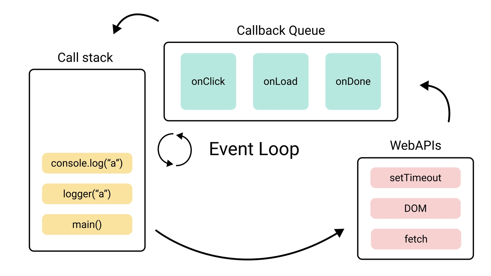

#### 1. What is the Higher Order function & callback function in JavaScript?

- there are several types of function available in typescript/javascript. higer order function one of them and higer order function is special type of function that can receive as parameter another function and also able to return another function as well.

```
function higerOrder(fn: Function): Function {
  return fn;
}

function hello() {
  console.log("Hello world");
}

higerOrder(hello)();
more example:map, filter , forEach

```

- Callback function is a function which is passed as an argument to another function
- Higer order function receives a function that is called callback function and it can be call inside the body of higer order function.

```
function higerOrder(fn: Function): Function {
  return fn;
}

function hello() {
  console.log("Hello world");
}

higerOrder(hello)(); hello is a callback function

```

#### 2.What is Scope in javascript?

- Scope is Boundary of variable it's permission that a variable wjere we can access and where we cannot access.
- In Javascript/Typescript there are three types of scope available. global scope, local scope and block scope.
- global scope: variable that decleared outside of the local scope and block sope and we can access this variable from any where in the program.

```
const name2: string = "ALamin"; //globally
function printName() {
  console.log(name2);
}
printName();
if (true) {
  console.log(name2);
}
```

- local scope: variable that decleared inside the function we are able to access this variable only inside this function. this variable is called local variable and this scope is called local scope.

```
function localScope() {
  const name2 = "Emon";
  console.log(name2);
}

localScope();
```

- block scope: variable that decleared inside the block we are able to access this variable only inside this block. this variable is called block variable and this scope is called block scope.
- example of block scope:if statement, for loop, while loop etc.

```
for (let i = 0; i < 5; ++i) {
  const name2 = "Emon";
  console.log(name2);
}
if (6 % 2 === 0) {
  const name2 = "Emon";
  console.log(name2);
}
```

#### 3 What is the difference between Call, Apply, and Bind?

- when we need explicit binding, we can use call , apply , and binding method. these three method are used to set the value of this keyword inside a function.
- call method: call method is used to call a function with a given this value and arguments provided individually.
- apply method: apply method is used to call a function with a given this value and arguments provided as an array.
- bind method: it as like call method but it dosenot called the function immidiatly instead it return a new function with the this value and arguments provided.

```
//role2:explicit binding


//!SECTION explicit binding
const printName = function (v1, v2, v3) {
  console.log(this.name);
};

const tamim = {
  name: "Tamim Iqbal",
  age: 37,
};

 printName.call(tamim);

const v1 = "Bangladesh";
const v2 = "India";
const v3 = "Pakistan";
const v = [v1, v2, v3];
 printName.apply(tamim, v);
const newFunc = printName.bind(tamim);
newFunc(v1, v2, v3);
```

#### 4.What is the difference between undefined and null ?

- undefined: undefined is a primitive value that is automatically assinged to variable when it is decleraed but not intialized. it is also represent absence of value. this type is undefined.
- null: null also a primitive value that represent absence value but intensionally developer assign null in any variable.

```
let a = undefined;
let b = null;

console.log(a == b);   // true
console.log(a === b);  // false

console.log(typeof a); // "undefined"
console.log(typeof b); // "object"  this is a js bug

// Math এ ব্যবহার
console.log(a + 1); // NaN
console.log(b + 1); // 1 ⚠️ (null = 0 হিসেবে কাজ করে)

```

#### 5.What is Cookie?

- cookie is a small piece of data that is stored on the browser by web server.it is use to store user information and prefecrnces.it helps us to communicate between client and server.every time we are required to send cookie to the server when we want to send request to the srver.
- how to work cookie:
  - website login
  - server craft cookie and send to the browser
  - borwser store this cookie
  - after thet when we send request to the server then browser send this cookie to the server
  - server recognize me by this cookie and send response to the browser
- cookies properties:
  - expires: how long the cookie will be stored in the browser
  - path: the path of the cookie
  - secure: only https
  - httpOnly: javaScript cannot access this cookie
  - sameSite: only send cookie to the same site
- there are three types of cookie: session cookie, persistent cookie and third party cookie.
- drawback of cookie:
  - size is too small (4KB)
  - XSS attack
  - privacy issue

  ```
  create cookie
  document.cookie = "username=ALamin; expires=Fri, 31 Dec 2024 23:59:59 GMT; path=/";
  read cookie
  console.log(document.cookie);
  delete cookie
  document.cookie = "username=; expires=Thu, 01 Jan 1970 00:00:00 GMT; path=/";

  ```

#### 6.what is promise in javascript?

- A Promise is like a guarantee that something will happen in the future — either success or failure.
- promise is an object that handle javascript asynchronouse operation
- it has 3 state: pending , fullfilled and rejected
- when the operation is success then resolve is called and .then() handle the result
- when the operation is filed then reject iscalled and .catch() handle the error
- promise was introduce for resolve the callback hell porblem and make asynchronous code clean and more readable.

```
// Same job — different style

//
function getUser() {
    fetch("api/user")
        .then(res => res.json())
        .then(data => console.log(data))
        .catch(err => console.log(err));
}

//  Async/Await way
async function getUser() {
    try {
        const res = await fetch("api/user");
        const data = await res.json();
        console.log(data);
    } catch(err) {
        console.log(err);
    }
}
```

#### 7.What is an event loop? How does javaScript handle asynchronous tasks?

- event loop is a mecahanism that handle asynchronous task in javascript. we know javasript is a single thread programming language, it means javascript can execute one task at a time. but in rea;l world application we need to handle multiple task at at time.
- so how to chandle multiple task at a time..?
- in v8 engine have a call stack. it is able to hanlde synchronous task one by one. when call stack get any asynchronopus task then it send this to web api then handle it web api. after that it send callback function to this call abck queue.now event loop craft a bridge between call stack and call back queue.event loop cheak call stack is empty or not if it is empty then it send this callback function to call stack and execute this synchronously.this is how javascript handle asynchronous task.
  

#### 8.How can you eliminate duplicate values from a JavaScript array?

- there are several ways to elimante duplicate values from a JavaScript array. some of them are:
- filter + indexOf - this method is used to filter the array and return only unique values.
- for loop + indexOf - this method is used to loop through the array and return only unique values.
- filter + findIndex - this method is used to filter the array and return only unique values.

##### all complexity O(n^2) which is not good for large array

- best approch by SET - its complexity is O(n) and it is very easy to implement.

```
const numbers = [1, 2, 3, 4, 5, 5, 6, 6, 7, 7, 8, 8, 9, 9, 10];
const unique = [...new Set(numbers)];
console.log(unique);
```

## Typescript

#### 1.What is an Interface in typescript?

- interface is a bluprint or contarct of an object
- it help us to define the structure of an object.it is also used to define the type of function and class
- interface is a compile time feature and it is not exist in runtime

```
interface User {
  name: string;
  age: number;
  email: string;
}
function greetUser(user: User) {
  console.log(
    `Hello, ${user.name}! Your email is ${user.email} and you are ${user.age} years old.`,
  );
}
greetUser({ name: "Alice", age: 30, email: "hello@gmail.com" });
```

#### 2.What is the difference between Type and Interface in typescript?

- type and interface are both used to define the structure of an object but there are some difference between them.
- intreface not supoport primitive type but type support primitive type
- interface not support union type but type support union type
- interface not support tuple type but type support tuple type
- in intrface we can extends by extends keyword but in type we can extends by intersection.
- in interface we cam merge two interface but in type we cannot merge two type.
- we can implemant class by both intreface and type.
  | Feature | Interface | Type |
  |---|---|---|
  | Primitive Type | ❌ Not Supported | ✅ Supported |
  | Union Type | ❌ Not Supported | ✅ Supported |
  | Tuple Type | ❌ Not Supported | ✅ Supported |
  | Extend | ✅ `extends` keyword | ✅ `&` Intersection |
  | Declaration Merging | ✅ Can merge two Interfaces | ❌ Cannot merge two Types |
  | Class Implementation | ✅ Supported | ✅ Supported |

#### 3. What is a type assertion in typescript?

- type assertion is a way to tell the compiler about the type of variable.it is also called type casting.
- type assertion is used when user sure about the type of variable but compiler is not sure about it.

```
const myType =  "strong" as string;
```

#### 4.How many access modifiers are there in typeScript?

- access modifiers are used to control the access of class mambers. there are three access modifiers in typescript: public, private and protected.

#### 5.What is the difference between public, private, and protected access modifiers?

- public : public access modifier is used to make the class mamber accesible from anywhere. by default all class members are public.
- private: when we use private modifier into any class member then it only accessible for this class and it is not accessible for any other class.
- protected: when we use protected modifier into any class member it can be accesible for its own class and which class is extende or inherit this class but it is not accessible for any other class.

#### 6.What are the three main primitive data types in TypeScript?

- primitive data type is most basic data type in typescipt. it only one value at a time and it is immutable.
- there are three main primitive data type in typescript: string, number and boolean. also null and undefined primitive data type
- string : string is sequmce of characters and it is used to reresend of text.
- number : number is used to represent of numeric value and it can be integer or floating point number.
- boolean : boolean is used to represent of logical value and it can be true or false.
